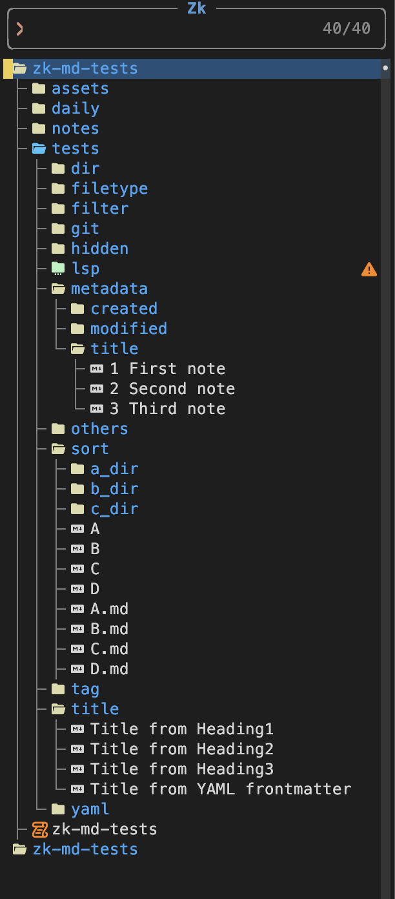
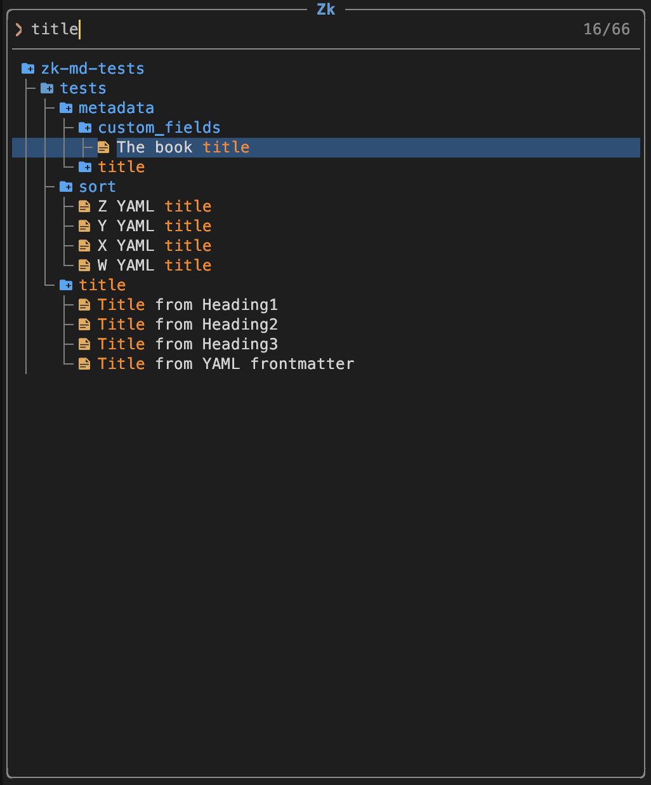
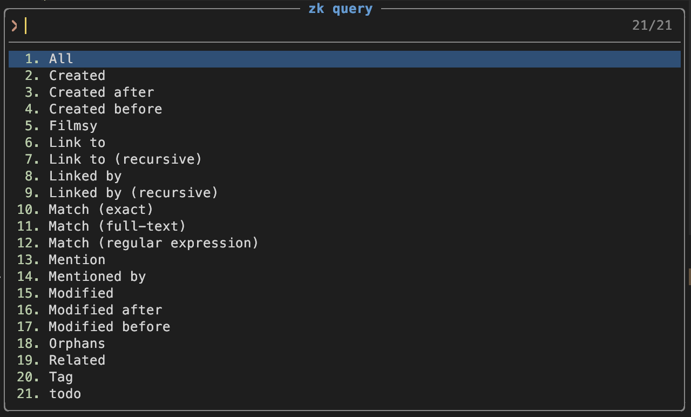
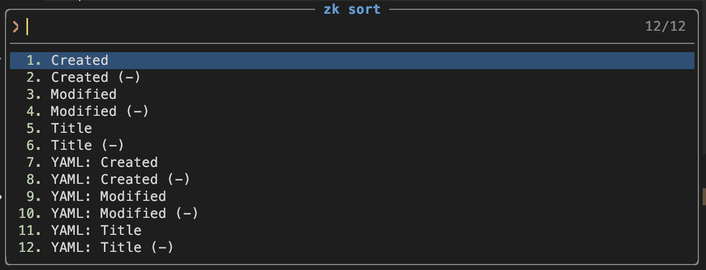

# snacks-zk-explorer.nvim


`snacks-zk-explorer.nvim` is a snacks source for zk, based on `Snacks.explorer`.

> [!Caution]
> This repository is still experimental. And this `README.md` is also work in progress.
> Be careful to use it.
> Any PR is apprecieated.

<!-- mtoc start -->
- [Features](#features)
- [Screen shots](#screen-shots)
- [Dependencies](#dependencies)
- [Install](#install)
- [Minimam Config](#minimam-config)
- [Usage](#usage)
- [Config](#config)
   - [Defaults](#defaults)
   - [Select](#select)
   - [Sort](#sort)
      - [Set Fields](#set-fields)
      - [Set a Sorter Function](#set-a-sorter-function)
      - [Change Sort](#change-sort)
      - [Add Custom Sorter Presets](#add-custom-sorter-presets)
   - [Queries](#queries)
      - [Add Custom Queries](#add-custom-queries)
- [Actions](#actions)
   - [Add Custom Actions](#add-custom-actions)
- [Issues](#issues)
- [TODO](#todo)
- [Related](#related)
<!-- mtoc end -->

Hereafter, abbreviated as `zk-explorer`.

## Features

- Tree style like `Snacks.explorer`
- Displays the title instead of the filename
- Search by filename and title
- Shows Git icons
- Shows Diagnostics icons
- Watch for files and directories changing.
- Sorters selector 
- Queries selector
- Built-in and custom Sorters
- Built-in and custom Queries
- Built-in and custom Actions
- User Config

## Screen shots

Main


Search


Queries


Sorters



## Dependencies

- [folke/snacks.nvim](https://github.com/folke/snacks.nvim)
- [zk-org/zk-nvim](https://github.com/zk-org/zk-nvim)
- [zk-org/zk](https://github.com/zk-org/zk)


## Install

for lazy.nvim:
```lua
{
  'riodelphino/snacks-zk.nvim',
  dependencies = { 'folke/snacks.nvim', 'zk-org/zk-nvim' },
}
```

## Minimam Config

for lazy.nvim:
```lua
{
  "folke/snacks.nvim",
  priority = 1000,
  lazy = false,
  config = function()
    ---@param snacks.Config
    require('snacks').setup({
      picker = {
        enabled = true,
        sources = {
          zk = {
            -- Set your custom config here (See #default-config)
          },
        },
      },
    })
    require('snacks.picker.source.zk').setup({}) -- Setup snacks-zk-explorer
  end,
  keys = {
    { '<leader>ze', function() Snacks.zk() end, desc = 'Snacks.zk()' },
  }
}
```

## Usage

Open:
```lua
Snacks.zk() -- Shortcut for Snacks.picker.zk()
Snacks.picker.zk()
require('snacks.zk').open() -- Call open() function directry
```
Open with custom config:
```lua
---@type (snacks.picker.zk.Config|{})?
local opts = {} -- Set your custom config here / See #default-config
Snacks.zk(opts)
Snacks.picker.zk(opts)
require('snacks.zk').open(opts)
```

Open in another layout:
```lua
Snacks.zk({ layout = "default" }) -- bottom|default|dropdown|ivy|ivy_split|left|right|select|sidebar|telescope|top|vertical|vscode
Snacks.zk({ layout = "left" }) -- 'left' (snacks-zk.nvim's default)
```

> [!Warning]
> `layout = "telescope"` breaks the order for `reverse = true` config.


## Config

See `lua/snacks/zk/source.lua`


### Defaults

```lua
zk = {
  enabled = function() -- Enabled only in zk directory
    local zk_util = require("zk.util")
    local notebook_path = zk_util.notebook_root(vim.fn.getcwd())
    return notebook_path ~= nil
  end,
  title = "Zk",
  finder = "zk", -- (fixed) Calls `require('snacks.picker.source.zk').zk()` function.
  reveal = true,
  supports_live = true,
  tree = true, -- (fixed) Always true on this picker and `false` not works
  watch = true,
  diagnostics = true,
  diagnostics_open = false,
  git_status = true,
  git_status_open = false,
  git_untracked = true,
  follow_file = true,
  focus = "list",
  auto_close = false,
  jump = { close = false },
  layout = { preset = "sidebar", preview = false },
  include = {}, -- (e.g. "*.jpg")
  exclude = {}, -- (e.g. "*.md")
  ignored = false,
  hidden = false,
  filter = {
    transform = nil, -- (fixed) *1
  },
  select = { "absPath", "filename", "title" }, -- Fields fetched by `zk.api.list`
  formatters = {
    file = {
      filename_only = nil, -- (fixed) *1
      filename_first = false,
      markdown_only = false, -- find only markdown files
    },
    severity = { pos = "right" },
  },
  format = nil, -- (fixed) *1
  matcher = {
    sort_empty = false, -- (Skipped) *3
    fuzzy = true, -- (Skipped) *3
    on_match = nil, -- (fixed) *1
    on_done = nil, -- (fixed) *1
  },
  -- Sort
  sort = { fields = { "sort" } }, -- *2
  sorters = require("snacks.zk.sorters"),
  -- Query
  query = { desc = "all", query = {} },
  queries = require("snacks.zk.queries"),
  query_postfix = ": ",
  -- Actions
  actions = require("snacks.zk.actions"),
  -- config = function(opts) -- This functions is not evaluated.
  --   return require("snacks.picker.source.zk").setup(opts)
  -- end,
  win = {
    list = {
      keys = {
        -- Supports explorer actions
        ["<BS>"] = "explorer_up",
        ["l"] = "confirm",
        ["h"] = "explorer_close", -- close directory
        ["a"] = "explorer_add",
        ["d"] = "explorer_del",
        ["r"] = "explorer_rename",
        ["c"] = "explorer_copy",
        ["m"] = "explorer_move",
        ["o"] = "explorer_open", -- open with system application
        ["P"] = "toggle_preview",
        ["y"] = { "explorer_yank", mode = { "n", "x" } },
        ["p"] = "explorer_paste",
        ["u"] = "explorer_update",
        ["<c-c>"] = "tcd",
        ["<leader>/"] = "picker_grep",
        -- ["<c-t>"] = "terminal", -- TODO: Duplicated key error with `["<c-t>"] = "tab"`. How to fix it?
        ["."] = "explorer_focus",
        ["I"] = "toggle_ignored",
        ["H"] = "toggle_hidden",
        ["Z"] = "explorer_close_all",
        ["]g"] = "explorer_git_next",
        ["[g"] = "explorer_git_prev",
        ["]d"] = "explorer_diagnostic_next",
        ["[d"] = "explorer_diagnostic_prev",
        ["]w"] = "explorer_warn_next",
        ["[w"] = "explorer_warn_prev",
        ["]e"] = "explorer_error_next",
        ["[e"] = "explorer_error_prev",
        -- zk actions
        ["z"] = "zk_change_query",
        ["Q"] = "zk_reset_query",
        ["s"] = "zk_change_sort",
        ["S"] = "zk_reset_sort",
        -- Unset default keymaps "z*" -- TODO: To avoid waiting next key after 'z'. Any other solutions?
        ["zb"] = false, -- "list_scroll_bottom",
        ["zt"] = false, -- "list_scroll_top",
        ["zz"] = false, -- "list_scroll_center",
        -- See lua/snacks/picker/config/defaults.lua
      },
    },
  },
},
-- *1 : Always dynamically overwritten by `setup()` in `zk.lua`
-- *2 : `explorer` completely skips `opts.sort`. But `zk-explorer` evaluates it.
-- *3 : Since searching in both `filename` and `title` is required, zk-explorer` does not use built-in commands like `fd`, `rg` or `find`.
```

> [!Note]
> `Tree` view is fixed for zk picker, since it is the purpose for this repo. So `{ tree = false }` not works.

### Select

Ensure that the fields used in querying or sorting are set in `select` config.
These fields are fetched by `zk.api.list`

```lua
-- Default (Minimam)
select = { "absPath", "filename", "title" },

-- Add metadata (metadata includes all YAML fields.)
select = { "absPath", "filename", "title", "metadata" },

 -- Add created, modified
select = { "absPath", "filename", "title", "created", "modified" },
```

The available fields are:
  filename, filenameStem, path, absPath, title, lead, body, snippets, rawContent, wordCount, tags, metadata, created, modified and checksum

> [!Note]
> * `metadata` fetches all the fields in YAML frontmatter.
> * `title` is fetched from YAML frontmatter first, then searched from the top level heading. (`#`, `##`, ...)
> * `tags` is fetched and mixed from both YAML frontmatter and the content (e.g. `#my_tag`).
> * `created` is the file created timestamp in filesystem. (Basically cannnot modify it.)
> * `modified` is the file modified timestamp in filesystem.

See [zk-list](https://zk-org.github.io/zk/tips/editors-integration.html#zk-list)


### Sort

> [!Note]
> Sorting is available for both Node and Item in `zk-explorer`.

> [!Warning]
> For now, sorters don't work correctly when searching with the `/` key.
> Only the default sort works properly.

There are two ways to define sorting.

#### Set Fields

Accepts both string and table.

```lua
-- by item.sort field (Asc)  (Default)
sort = { fields = { 'sort' } }

-- by item.sort field (Asc explicitly)
sort = { fields = { 'sort:asc' } }

-- by item.sort field (Desc)
sort = { fields = { 'sort:desc' } }

-- by the length of item.name string
sort = { fields = { "#name" } }

-- by existing of item.zk.title
sort = { fields = { "!zk.title" } } -- *
-- * Ensure that "title" field is added into `opts.select`.

-- by layered field (and use zk field)
sort = { fields = { 'zk.title' } } -- *
sort = { fields = { 'zk.modified' } } -- *
sort = { fields = { 'zk.metadata.created' } } -- *
-- * Ensure that "title" or "modified" or "metadata" fields are added into `opts.select`.

-- Almost same with `fields = { "sort" }`
sort = { fields = { "dir", "hidden:desc", "!zk.title", "zk.title", "name" } },

-- by mutliple fields in item
sort = {
  fields = {
    "dir",        -- by item.dir (Asc) = dir first
    "name",       -- by item.name (Asc)
    "idx"         -- by item.idx (Asc) = insertion order
  }
}

-- by detailed table
sort = { 
  fields = {
    name = "name",  -- by item.name field
    desc = true,    -- Descending
    len = true      -- Use length for sort (default: false)
  }
}
-- Same with "#name:desc"

-- by combined list (detailed table and field name)
sort = { 
  fields = { 
    { name = "score", desc = true },  -- by item.score (Desc)
    "name"                            -- by item.name (Asc)
  }
}

-- Default sorting when `sort.fields` is not set
sort = { 
  fields = { 
    { name = "score", desc = true },  -- by score (Desc)
    "idx"                             -- by Insertion order (Asc)
  }
}
```
#### Set a Sorter Function

A function can be set directly.

Simple:
```lua
---@param a snacks.picker.zk.Node|snacks.picker.zk.Item
---@param b snacks.picker.zk.Node|snacks.picker.zk.Item
sort = function(a, b)
   return a.name < b.name
end,
```

Same with `sort = { fields = { "sort" } }`:
```lua
---@type snacks.picker.zk.Sort
sort = function(a, b)
  local an = notes[a.path] or nil
  local bn = notes[b.path] or nil
  local at = an and an.title
  local bt = bn and bn.title
  local a_has_title = (at ~= nil)
  local b_has_title = (bt ~= nil)
  local a_is_dot = (a.name:sub(1, 1) == ".")
  local b_is_dot = (b.name:sub(1, 1) == ".")
  if a.dir ~= b.dir then
    return a.dir
  end
  if a_is_dot ~= b_is_dot then
    return not a_is_dot
  end
  if a_has_title ~= b_has_title then
    return a_has_title
  end
  if a_has_title and b_has_title then
    return at < bt
  end
  return a.name < b.name
end,
```

#### Change Sort

Keymaps (in the file tree):
   - `s` key shows a list of sorters.
   - `S` key reset the current sorter.


Built-in sorters:
  - Title
  - Title (-)
  - Created
  - Created (-)
  - Modified
  - Modified (-)

no sign = "asc"
(-)     = "desc"


#### Add Custom Sorter Presets

Custom sorter presets can be added into `sorters = {}` config.
They will be appeared in the [change sort](#change-sort) list.

Add `metadata.status` sorter:
```lua
select = { "title", "absPath", "filename", "metadata"}, -- Ensure that the fields used in the sorter are set.
sorters = {
  metadata_status = {
    desc = "metadata.status"
    sort = { "!zk.metadata.status", "zk.metadata.status" },
    -- Above works, but following fields are recommended for more usable sorting.
    -- sort = { "dir", "hidden:desc", "!zk.metadata.status", "zk.metadata.status", "zk.title", "name" },
  },
}
```

Add sorters for custom YAML frontmatter fields:
```lua
select = { "title", "absPath", "filename", "metadata"}, -- Ensure that the fields used in the sorter are set.
sorters = {
   metadata_title_desc = {
      desc = 'YAML: Title (-)',
      sort = { 'dir', 'hidden:desc', '!zk.metadata.title', 'zk.metadata.title:desc', 'name:desc' },
   },
   metadata_created = {
      desc = 'YAML: Created ',
      sort = { 'dir', 'hidden:desc', 'zk.metadata.created', 'zk.metadata.title', 'name' },
   },
   metadata_created_desc = {
      desc = 'YAML: Created (-)',
      sort = { 'dir', 'hidden:desc', 'zk.metadata.created:desc', 'zk.metadata.title', 'name' },
   },
   metadata_modified = {
      desc = 'YAML: Modified ',
      sort = { 'dir', 'hidden:desc', 'zk.metadata.modified', 'zk.metadata.title', 'name' },
   },
   metadata_modified_desc = {
      desc = 'YAML: Modified (-)',
      sort = { 'dir', 'hidden:desc', 'zk.metadata.modified:desc', 'zk.metadata.title', 'name' },
   },
},
```


### Queries

Keymaps (in the file tree):
   - `z` key shows a list of queries.
   - `Q` key reset the current query(=All).

Queries in lua:
```lua
-- Change query
require('snacks.zk.actions').actions.zk_change_query()
-- Reset query
require('snacks.zk.actions').actions.zk_reset_query()
```

Built-in queries:
  - All (default)
  - Created
  - Created after
  - Created before
  - Modified
  - Modified after
  - Modified before
  - Match (exact)
  - Match (full-text)
  - Match (regular expression)
  - Mention
  - Mentioned by
  - Link to
  - Link to (recursive)
  - Linked by (recursive)
  - Linked by
  - Filmsy
  - Orphans
  - Related
  - Tag

#### Add Custom Queries

Add cusotm query `Todo`:
```lua
queries = {
  todo = {
    desc = "Todo",
    input = function(__, __, cb)
      cb({ desc = "Todo", query = { tags = { "todo" } } })
    end,
  },
},
```
Use custom query `todo`:
  `z` key in `zk-explorer`, then select `todo`.

## Actions

### Add Custom Actions

Not implemented yet...

```lua
actions = {
  zk_add_new = function()
    ...
  end,
},
```

Use Custom Actions:
```lua
win = {
  list = {
    keys = {
      ["A"] = "zk_add_new",
    },
  },
},
```

## Issues

- The focus is lost when queries/sorters `select.ui` is canceled.
- For now, almost sorters disorders the tree in searching with `/` key.

## TODO

- [ ] Add action for zk.api.new()
- [ ] Fix the order in searching


## Related

- [folke/snacks.nvim](https://github.com/folke/snacks.nvim)
- [zk-org/neo-tree-zk.nvim](https://github.com/zk-org/neo-tree-zk.nvim)
- [zk-org/zk-nvim](https://github.com/zk-org/zk-nvim)
- [zk-org/zk](https://github.com/zk-org/zk)

