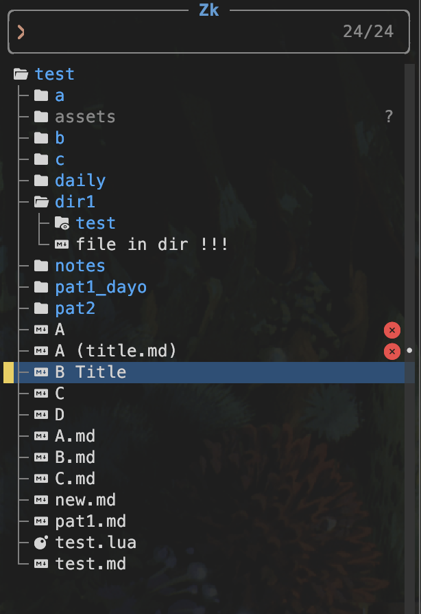
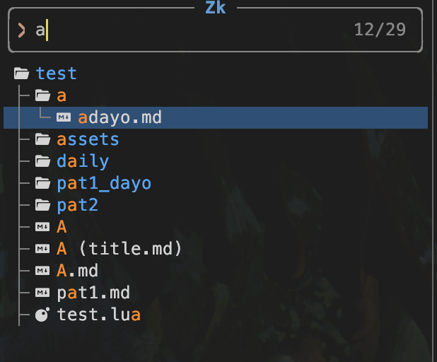

# snacks-zk.nvim


Snacks source for zk, based on `Snacks.explorer`.

> [!Caution]
> This repository is experimental.
> Be careful to use it.
> Any PR is apprecieated.

## Features

- Tree style like `Snacks.explorer`
- Displays the title instead of the filename
- Shows Git and Diagnostics sign icons
- Search by the title
- Watch for files and directories (add/modify/rename/delete) 

## Screen shots

:lua Snacks.zk()


Search 'a'


## Issues

- It does not provide any `queries` or `actions` like [neo-tree-zk.nvim](https://github.com/zk-org/neo-tree-zk.nvim) does.


## Dependencies

- [folke/snacks.nvim](https://github.com/folke/snacks.nvim)
- [zk-org/zk-nvim](https://github.com/zk-org/zk-nvim)
- [zk-org/zk](https://github.com/zk-org/zk)


## Install

for lazy.nvim:
```lua:snacks-zk.lua
return {
  'riodelphino/snacks-zk.nvim',
  dependencies = { 'folke/snacks.nvim', 'zk-org/zk-nvim' },
  keys = {
    { '<leader>ze', function() Snacks.zk() end, desc = 'Snacks.zk()' },
  }
}
```
* Automatically snacks calls `M.setup()` function in `lua/snacks/picker/source/zk.lua` on loading this picker.


## Config

It has no options yet.


## Usage

Open:
```lua
Snacks.zk() -- Shortcut for Snacks.picker.zk()
Snacks.picker.zk()
require('snacks.zk').open() -- Call open() function directry
```
Open with custom config:
```lua
---@type (snacks.picker.explorer.Config | {})?
local opts = {} -- Set your custom config here / See defaults at `lua/snacks/zk/source.lua`
Snacks.zk(opts)
Snacks.picker.zk(opts)
require('snacks.zk').open(opts)
```

Open in another layout:
```lua
Snacks.zk({ layout = "default" }) -- bottom|default|dropdown|ivy|ivy_split|left|right|select|sidebar|telescope|top|vertical|vscode
Snacks.zk({ layout = "left" }) -- 'left' (snacks-zk.nvim's default)
```

`Tree` view is fixed for zk picker, since it is the purpose for this repo. So `{ tree = false }` not works.

## TODO

- [ ] Provide options for users
- [ ] Provide custom actions for zk?
- [ ] Provide queries(filters)?
- [ ] Provide custom queries


## Related

- [folke/snacks.nvim](https://github.com/folke/snacks.nvim)
- [zk-org/neo-tree-zk.nvim](https://github.com/zk-org/neo-tree-zk.nvim)
- [zk-org/zk-nvim](https://github.com/zk-org/zk-nvim)
- [zk-org/zk](https://github.com/zk-org/zk)

